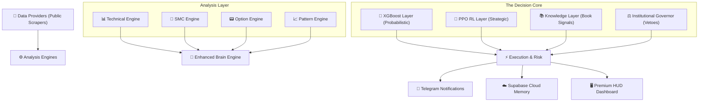

# Titan Plus: Institutional System Architecture

This document provides a comprehensive blueprint of the **Titan Plus** backend architecture, detailing how the 25,000+ lines of code orchestrate Institutional-grade trading decisions.

## 🏗️ High-Level System Design

The system follows a **Modular Asynchronous Pipeline** where each layer operates with single-responsibility autonomy, feeding into the Central Brain.

---

## 🛰️ 1. The Signal Lifecycle (Journey of a Trade)

### Phase 1: Ingestion & Sentinel
Every 1 second, the `run_engine_loop` in [api.py](file:///f:/FnO/backend/api.py) triggers. The **Data Sentinel** fetches real-time Spot, Future, and Option Chain data for NIFTY, BANKNIFTY, and SENSEX.

### Phase 2: Multi-Engine Synthesis
1.  **Technical Engine**: Calculates "Pin-Point" levels. It doesn't just look at RSI; it finds **Fractals** and **Order Blocks** (where institutions hid their orders).
2.  **SMC Engine**: Scans for **Fair Value Gaps (FVG)** and **Liquidity Sweeps** (stop hunts).
3.  **Option Engine**: Performs **X-Ray Analysis** on the chain. It calculates **GEX (Gamma Exposure)** to see where market makers are forced to hedge.

### Phase 3: The Nuclear Decision (Confluence)
The [Enhanced Brain Engine](file:///f:/FnO/backend/brain_engine_enhanced.py) receives all metrics. It requires a **Triple-Confluence**:
*   **XGBoost**: "Is the historical probability of success > 75%?"
*   **PPO RL**: "Does the self-learning agent see a high-value entry?"
*   **Knowledge**: "Does this match institutional setups (e.g., Chetan's Hammer S1)?"

### Phase 4: Risk Governance
Before a signal is born, the **Governor** applies 4 Vetoes:
1.  **VIX Veto**: If VIX > 25, the signal is killed (Market Panic).
2.  **Synergy Veto**: If NIFTY and BANKNIFTY are diverged, the signal is killed.
3.  **Basis Veto**: If Future-Spot spread is unstable, the signal is killed.
4.  **Liquidity Veto**: If the strike has a spread > 5%, it's rejected.

### Phase 5: Execution & Persistence
Once approved, the signal is pushed to:
*   **Telegram**: Using a **Recursive DNS Bypass** (DoH) to ensure delivery even in restricted environments.
*   **Supabase**: Logged into the `signal_ledger` for permanent accuracy tracking.
*   **Dashboard**: Pushed to your Premium HUD via real-time WebSocket/Polling.

---

## 🧠 2. Core Engines Deep-Dive

### 📊 Technical & SMC (Institutional Logic)
Unlike retail indicators, these look for **Imbalances**:
*   **Order Blocks (OB)**: Detected when a high-volume candle breaks structure. We set our entries at the 50% "Mean Threshold" of these blocks.
*   **Fair Value Gaps (FVG)**: Price "holes" that the market *must* return to fill.
*   **Liquidity Sweeps**: When price dips below a low to grab "Retail Stops" before reversing.

### 📟 Option Engine (GEX & Max Pain)
This is the "Secret Sauce":
*   **GEX (Gamma Exposure)**: We calculate the Delta and Gamma of the entire chain. If GEX is negative, we expect high volatility.
*   **Max Pain**: We find the strike where most retail traders lose money—this is where institutions usually drive the expiry.
*   **Strike Selection**: We don't just pick ATM. We scan 3 strikes away for the **highest liquidity dominance** to ensure you aren't trapped in a low-volume option.

---

## 💼 3. Examples & Case Studies

### 🟢 Case A: Bullish "Golden Setup"
1.  **Price**: Dips into a **Bullish Order Block**.
2.  **SMC**: A **Liquidity Sweep** happens at the day's low.
3.  **Option Chain**: Put Writers (Support) outnumber Call Writers by 2:1.
4.  **XGBoost**: Returns `0.88` probability.
5.  **Decision**: **BUY_CALL** | Smart TP set at the next **Fair Value Gap**.

### 🔴 Case B: Bearish "Trap Detection"
1.  **Price**: Rallies into a **Resistance Fractal**.
2.  **GEX**: Signals a "Gamma Flip" (Makers becoming short).
3.  **Synergy**: NIFTY is up, but BANKNIFTY is starting to bleed (Divergence!).
4.  **Veto**: Governor detects the divergence.
5.  **Decision**: **BLOCK (WAIT)** | Thought: "Correlated Asset Divergence Detected. BLOCKED."

---

## 🛡️ 4. Error Handling & Resilience
*   **Auto-DNS Fallback**: If standard internet fails, the system switches to **DoH (DNS-over-HTTPS)** to keep Telegram alive.
*   **NaN Resilience**: The RL engine has a "Nuclear NaN Guard" to prevent math errors from crashing the bot during high-volatility spikes.
*   **Stale Data Guard**: If the scrapper stops, the bot goes into "Hibernation" to prevent trading on old data.

---

> [!TIP]
> **Pro Tip**: The `Sub-Neural Flow` on your dashboard shows the "Thought Process" of these engines in real-time. If you see a "VETO" reason, the system has successfully saved you from a low-probability trade!
